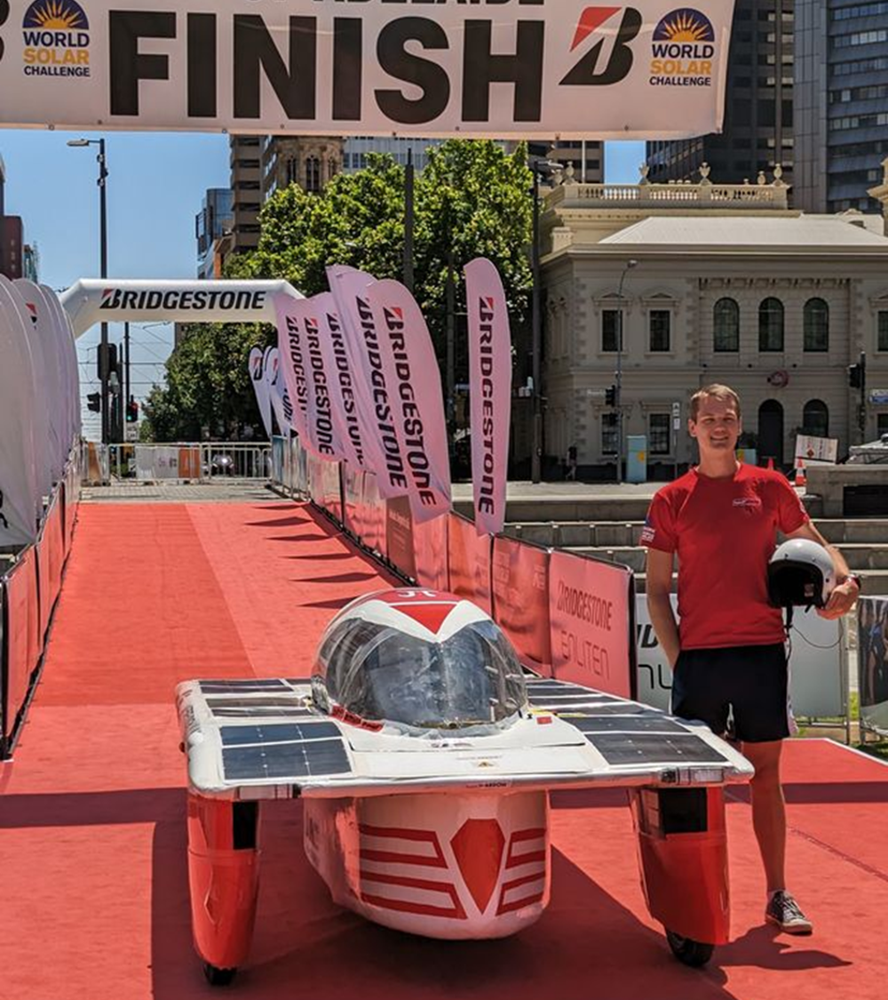
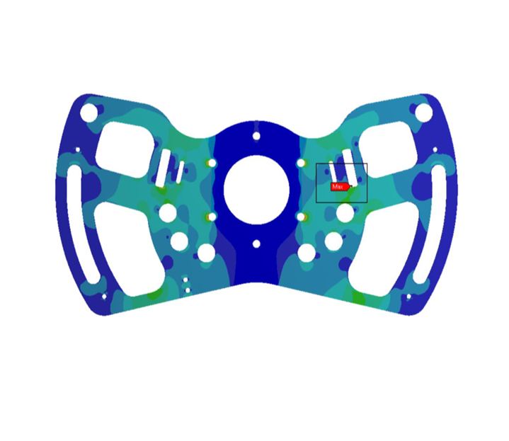
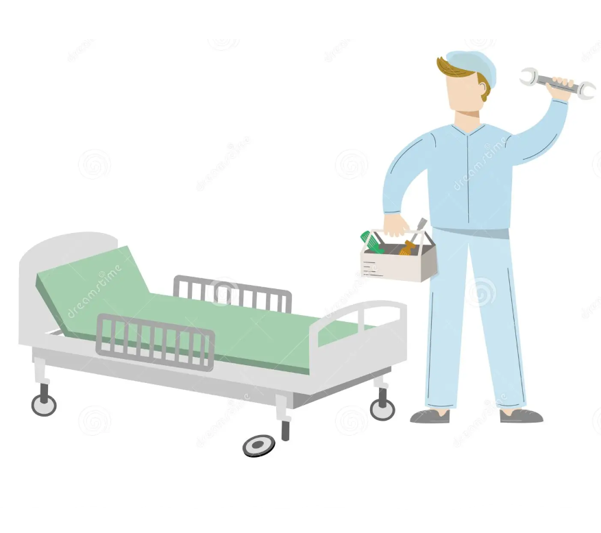
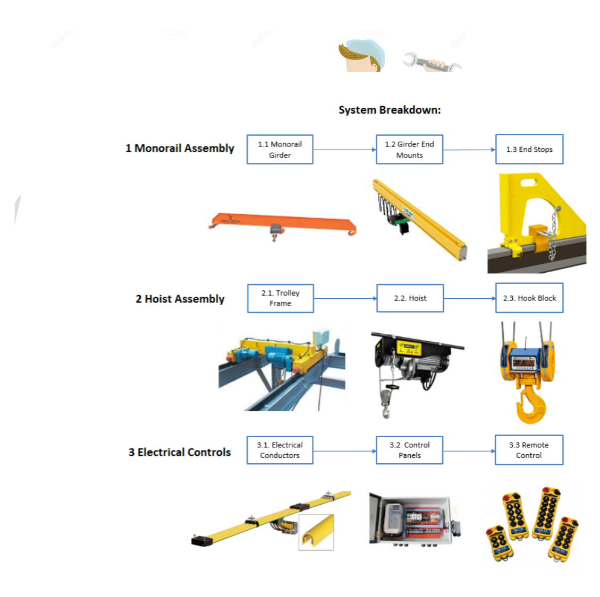
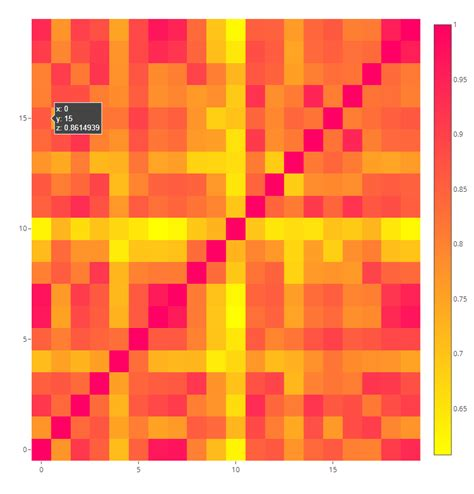
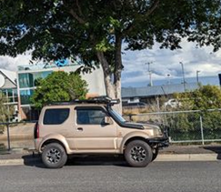

# Engineering & Professional Portfolio

## Brad Seeley

[LinkedIn](https://www.linkedin.com/in/brad-seeley/)

**Bs Engineering (Hons)** 
**Major:** Mechanical 
**Minors:** Software & IT 

### Read more about:

|
   
|   |
|:---:|:---:|
||[Undergraduate thesis on cable steering](./pages/thesis.md)|
||[Competing with TeamArrow in the BWSC](./pages/BWSC.md)|
||[The 2023 adventure of passing BWSC scrutineering](./pages/solar-car-certification.md)|

 <table>
<tr><td width="250px">

 
[Undergraduate thesis on cable steering](./pages/thesis.md)
 
</td><td width="250px">

</td><td>
<a href="./pages/BWSC.md">Competing with TeamArrow in the BWSC</a>
</td></tr>
<tr><td>

<a href="./pages/solar-car-certification.md">The 2023 adventure of passing BWSC scrutineering</a>
</td><td>

<a href="./pages/traineeship.md">Certificate II in Engineering traineeship</a>
</td></tr>
<tr><td>

<a href="./pages/TMP-FMECA.md">TMP/FMECA development</a>
</td><td>

<a href="./pages/plotly.md">Python plotly-dash dashboard</a>
</td></tr>
<tr><td>

<a href="./pages/hobbies.md">Hobbies & personal projects</a>
</td>
<td></td>
</tr>
</table>

