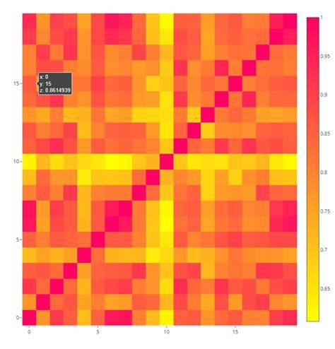

# Engineering & Professional Portfolio

## Brad Seeley

Hi there,  
My name is Brad Seeley. I am a mechanical and software engineer living in the UK.  
Thanks for checking out my page. While you're here, please take a look below at some of the projects I have worked on. 

**Bs Engineering (Hons)** 
**Major:** Mechanical 
**Minors:** Software & IT 

[LinkedIn](https://www.linkedin.com/in/brad-seeley/)

### Read more about:
||[About me](./pages/about-me.md)|
|:---:|:---|
||**[Undergraduate thesis on cable steering](./pages/thesis.md)**|
||**[Competing with TeamArrow in the BWSC](./pages/BWSC.md)**|
||**[The 2023 adventure of passing BWSC scrutineering](./pages/solar-car-certification.md)**|
||**[Certificate II in Engineering](./pages/traineeship.md)**|
||**[TMP/FMECA development](./pages/TMP-FMECA.md)**|
||**[Python plotly-dash dashboard](./pages/plotly.md)**|
||**[Hobbies & personal projects](./pages/hobbies.md)**|

