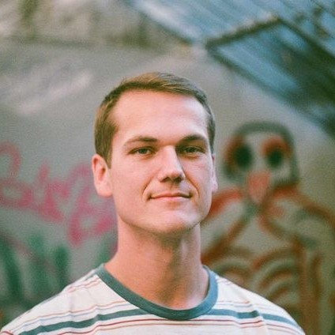
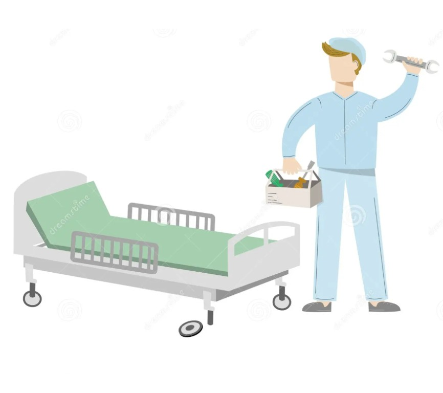
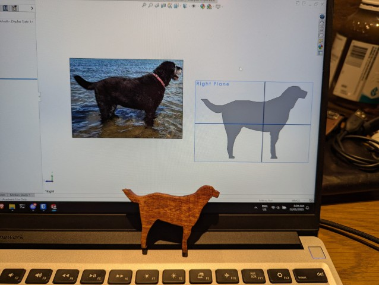
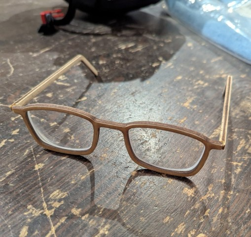
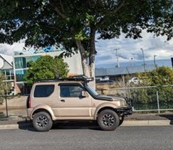

# Engineering & Professional Portfolio

## Brad Seeley

Hi there,  
My name is Brad Seeley. I am a mechanical and software engineer living in the UK.  
Thanks for checking out my page. While you're here, please take a look below at some of the projects I have worked on. 

**A brief blurb on Brad**
- From Brisbane, Australia; living in the United Kingdom
- Bachelor's (Honours) degree in Mechanical & Software Engineering
- Hobbies include working on cars (conventional and solar)
- Five years experience in TeamArrow, competing in the World Solar Challenge
- Professional experience in consulting, mining, aviation - working as an analyst, maintenance and software engineer

### Get in touch 
Reach out on my **[LinkedIn profile](https://www.linkedin.com/in/brad-seeley/)**  
Or **[send me an email](mailto:contact@brad-seeley.com)** - contact@brad-seeley.com 

### Read more about: 

|[][about-me]|[About me][about-me]|
|:----:|:----|
|[][thesis]	|**[Undergraduate thesis on cable steering][thesis]**		|
|[][BWSC]		|**[Competing with TeamArrow in the World Solar Challenge (BWSC)][BWSC]**|
|[][traineeship]|**[Certificate II in Engineering][traineeship]**		|
|[][TMP-FMECA]	|**[TMP/FMECA development][TMP-FMECA]**				|
|[][lifecycle-modelling]	|**[Lifecycle cost modelling][lifecycle-modelling]**	|
|[][plotly]	|**[Python plotly-dash dashboard][plotly]**			|
|[][sklearn]	|**[Python machine learning classifier][sklearn]**		|
|[][chloe-cutout]|**[Making an anniversary gift for my partner][chloe-cutout]**	|
|[][timber-glasses]|**[A fun project of trying to make timber frames for my glasses][timber-glasses]**	|
|[][hobbies]	|**[Hobbies & personal projects][hobbies]**			|
|[][jimny]	|**[My suzuki Jimny; some trials and tribulations...][jimny]**	|
|[][film]		|**[Film Photography][film]**					|

<link href="./pages/style.css" type="text/css" rel="stylesheet">

[about-me]: ./pages/about-me "About me"
[thesis]: ./pages/thesis "My Honours thesis"
[BWSC]: ./pages/BWSC "Competing in the World Solar Challenge"
[traineeship]: ./pages/traineeship "Working as a Fitter"
[TMP-FMECA]: ./pages/TMP-FMECA "Building TMPs and FMECAs for operational and cost effectiveness"
[lifecycle-modelling]: ./pages/lifecycle-modelling "Lifecycle cost modelling for assets to assist operational and financial planning." 
[plotly]: ./pages/plotly "Building an interactive dashboard with Python"
[sklearn]: ./pages/sklearn "Using an ML Classifier to visualise machine drift"
[hobbies]: ./pages/hobbies "Personal projects and hobbies"
[chloe-cutout]: ./pages/chloe-cutout "Making a gift for my partner on our fifth anniversary"
[timber-glasses]: ./pages/timber-glasses "Reverse engineering a pair of glasses to fit some existing lenses"
[film]: film-portfolio "A passtime of film photography"
[jimny]: pages/jimny "My golden nugget - it is both the light and darkness of my I spend free time."

[brad-email]: contact@brad-seeley.com
