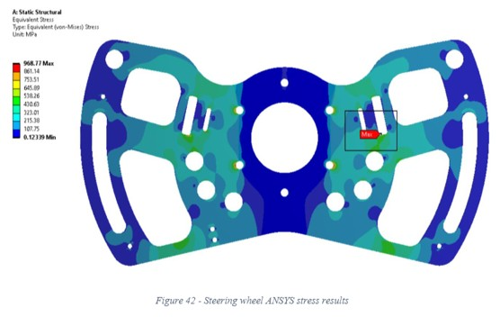

## Design of steering system for 3-wheeled solar vehicle   Undergraduate Thesis project

As an avid member of TeamArrow Racing Association, I partnered with my university to complete my thesis on researching an innovative steering system for the upcoming vehicle.  

This involved collecting information across industries, applications, and technologies to determine a suitable and successful design. 
The key criteria from TeamArrow were safety, reliability, light-weight, and low cost. 
 

While the team had previously used rack+pinion systems with success, the system of choice was cable-driven, to best achieve the criteria. 
 

**Grade: High Distinction (>85%)** 

**[Home](./..)**

<link href="style.css" type="text/css" rel="stylesheet">
