### A fun journey into making my own glasses frames (still in progress)

In April I managed to break my favourite pair of glasses. 
15 months earlier, I had ordered a cheap pair online as backups, which very quickly became my favourite specs.  
Come April when they were broken, I had to resort to my original, less comfortable (though more expensive) pair. 
 

When I ordered these glasses they came with a spare pair of lenses, how great! Or so I thought...
 

After I broke the frame of my glasses, I (foolishly) threw them out, not thinking I could still make use of them.  
While procrastinating ordering replacements online, I remembered these spare lenses, and decided I should make my own frames to put them to use.  

 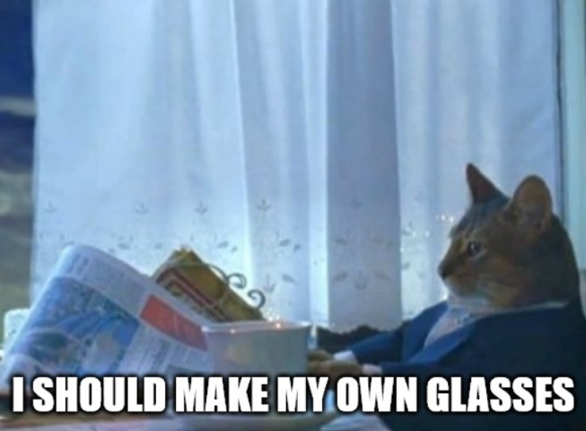 

The goal was to make something simple, that I could make with relative precision (not hand carved), using tools available at my local Hackspace (or Makerspace). 
Later revisions could add features like hinges, but for v1, simplicity was the name of the game. 
 

Taking a photo of the lens, with a ruler in frame to use for scale, I was able to use this as the basis for a CAD sketch. 
I used [photopea](https://photopea.com) (an online photoshop alternative) to remove the backgrounds and isolate just the ruler and the outer profile that I needed.  
 
[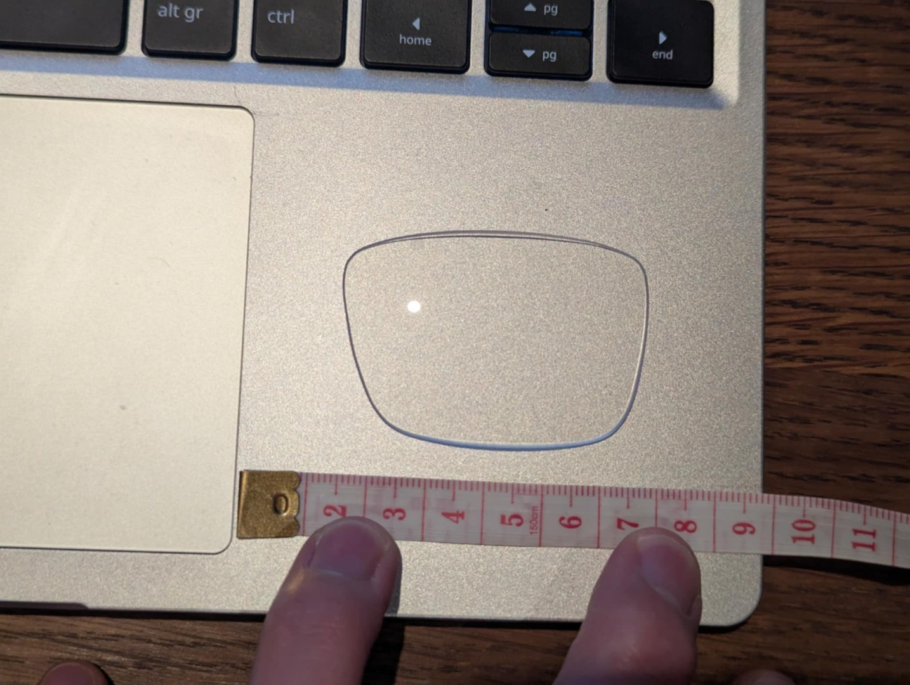](./../../imgs/full/timber-glasses-process-1.jpeg)
[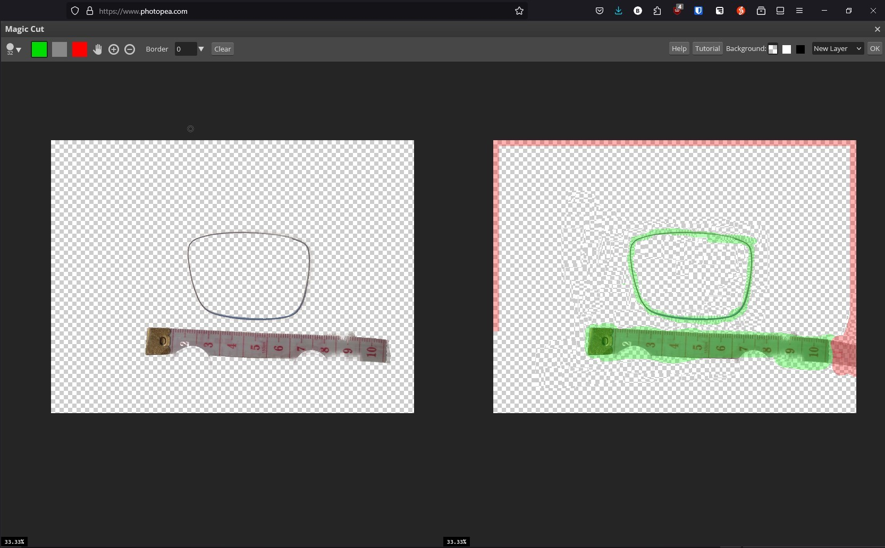](./../../imgs/full/timber-glasses-process-2.jpeg)

 

Then using SolidWorks, I imported the picture using the Sketch Picture tool (sketch -> Tools/Sketch Tools/Sketch Picture), and drew a spline along the profile for the cutout  
I copied that curve using the Offset Entities feature, I created the outer part of the frame. Adding a centreline, I mirrored these components to make the other side, before drawing a nose bridge and side wings to attach the arms.
This version, v1, was 3 laser cut parts, that could be glued together. The frame needed some minor adjustment to fit the lenses, but v1 was a success.  
[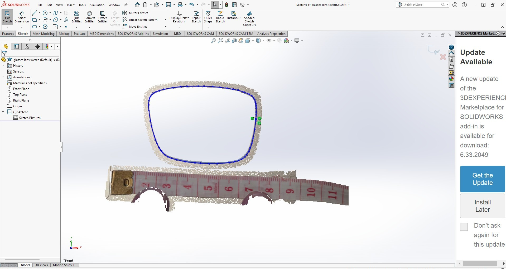](./../../imgs/full/timber-glasses-SolidWorks-Sketch-Picture-tool.jpeg)
[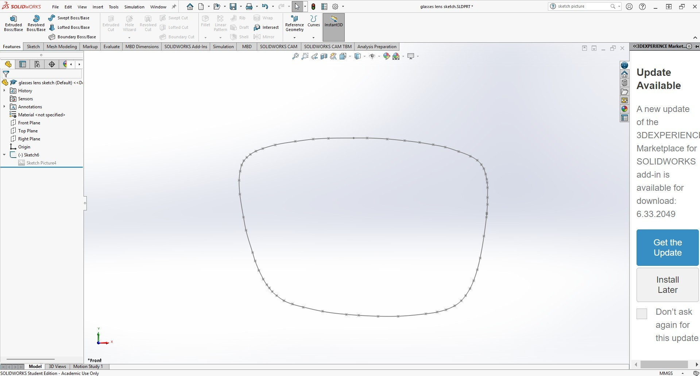](./../../imgs/full/timber-glasses-lens-spline-v1.jpeg)
[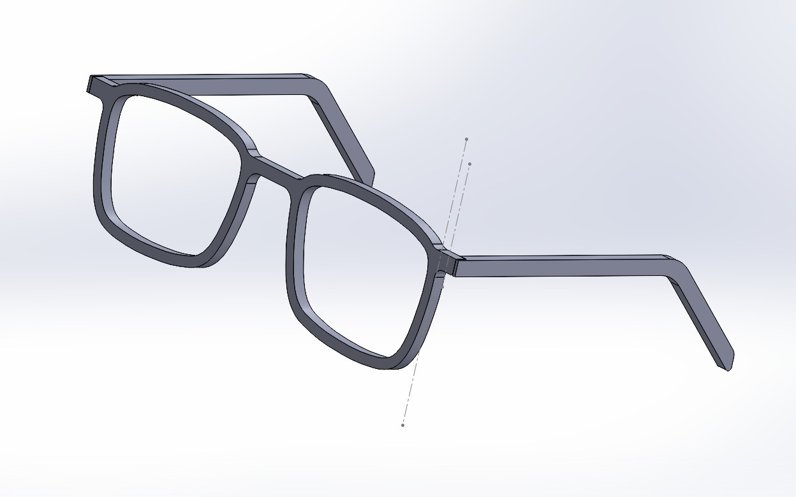](./../../imgs/full/timber-glasses-v1-assembly.jpeg)

 

When adding the lenses, I thought I must have had my prescription backwards, or maybe my eyes had changed. Sadly upon further inspection, I noticed these were not prescription lenses, merely the display lenses that the glasses were manufactured with.  
While the people I had shown the first prototype to were very supportive, saying things like "oh they will still make nice safety glasses", it wasn't what I was looking for.  
Fortunately for me, these were cheap glasses, so I ordered a replacement pair online from [SmartBuyGlasses](https://smartbuyglasses.co.uk), to have some proper lenses to test with. 
 
These fit well, and I was quite happy with the assembled frame, but more work was needed (including new lenses).  
[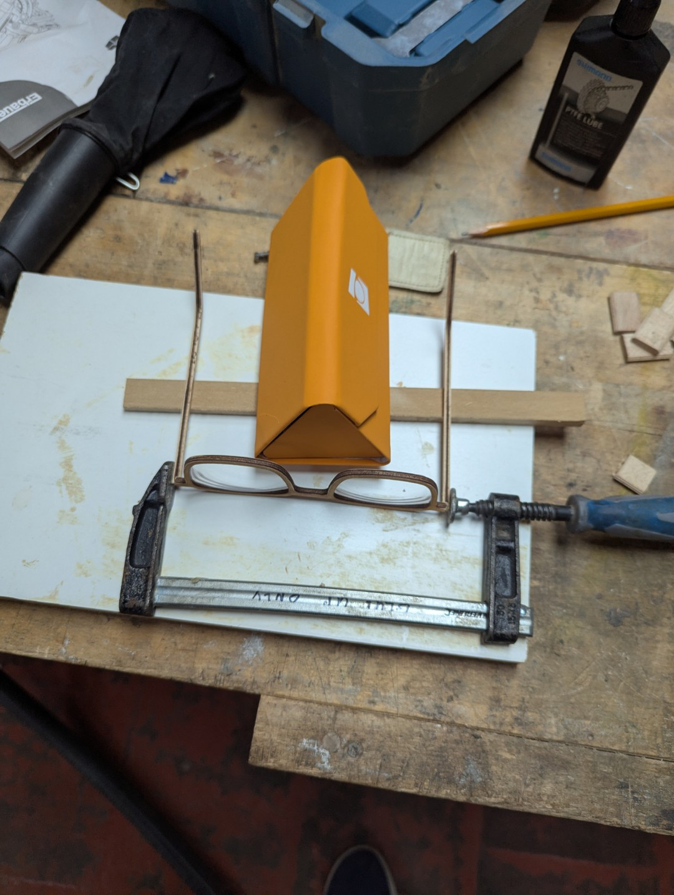](./../../imgs/full/timber-glasses-v1-glue-up.jpeg)
[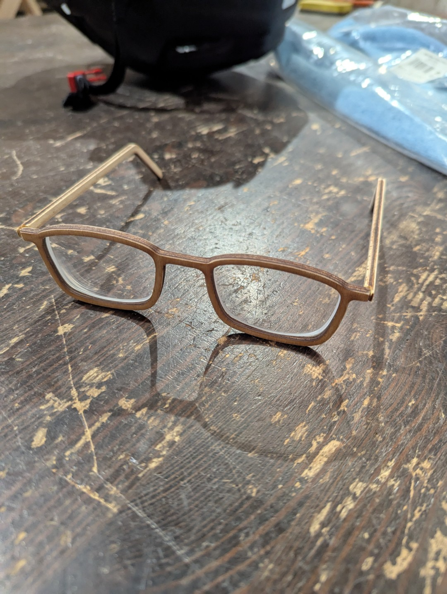](./../../imgs/full/timber-glasses-v1-asssembled.jpeg)
[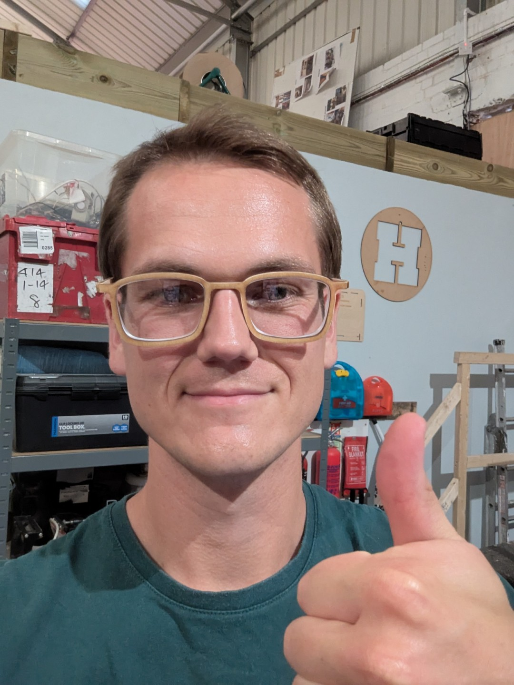](./../../imgs/full/timber-glasses-v1-success.jpeg)

 

For v2 I decided it needed to be easier to assemble the glasses, but I wanted to get a comfortable frame profile before adding complexity.  
I opted for a mortise & tenon system to join the arms to the frame. This worked well, where I could assemble the glasses without glue and still have a strong structure.  
I also re-sketched the lens drawing, making it wider than v1, as I hadn't accounted for the extra thickness that my full prescription would add.  
[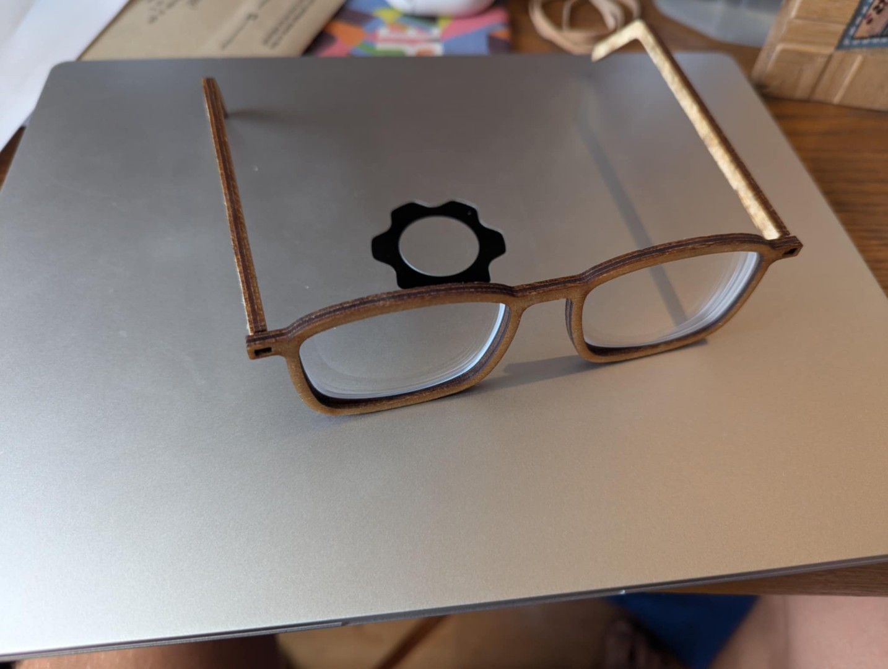](./../../imgs/full/timber-glasses-v2-assembled.jpeg)
[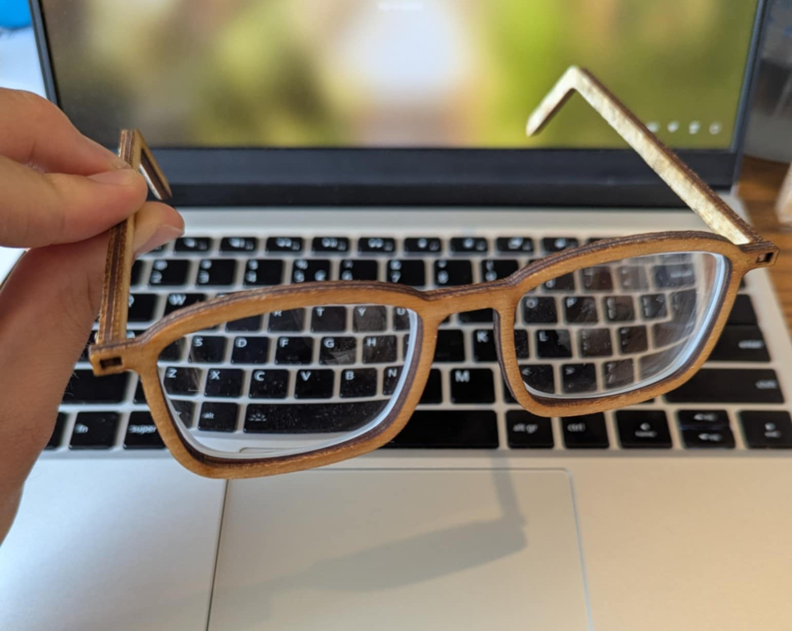](./../../imgs/full/timber-glasses-v2-frame.jpeg)

 

V3 and beyond is still yet to come. The list of features to be added are: 
- some type of simple hinge mechanism. 
- test (even) wider lens cutout, vs instepped rabbet cut from the router. 
- Thinner or different materials. 

***Watch this space.***

**[Home](./..)**

<link href="style.css" type="text/css" rel="stylesheet">
